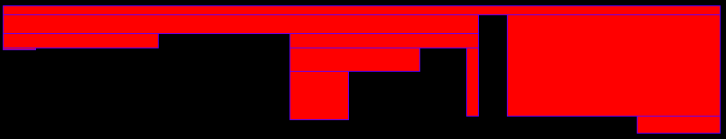
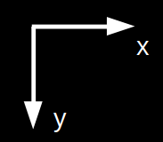
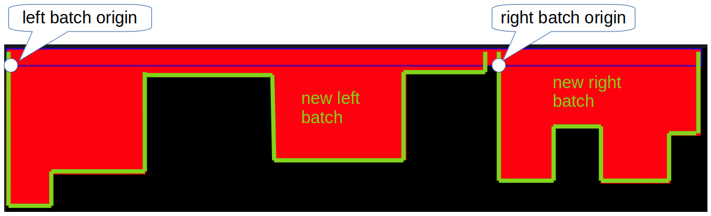

# Rectangle Madness

This little programm let's you create a couple of vertically adjacent rectangles with random heights and widths.


Based on this, the algorithm will recreate the outline using the minimal amount of *horizontal* rectangles. 



## How to use
### Linux
Simply run 
```
make
```
This will create a *bin* directory under which you will find the executable.
Example run:
```
./rectangle_madness -n 10 -p
```
Pass as command prompt arguments the amount of rectangles you want to create and if the results shall be exported as a .png or not.
### Windows
Most likely the easiest way is to use
```
cargo build --release
```
This will place the resulting binary under the *target/release* directory. The execution is the same as mentioned above.
### Tests
Use the following command to run the tests:
```
cargo test
```
## How does the algo work
### Definitions
A rectangle is defined by two points:
- top left and
- bottom right.

The used coordinate system is the following:



### Vertical rectangles
As a first step a canvas is created with defined dimensions.
Afterwards the selected amount of rectangles are created and vertically adjacently placed next to each other from left to right.
The *top right* corner of the previous rectangle serves as the origin (= *top left*) of the next one.

### Horizontal rectangles
After all the rectangles have been put on the canvas, the algo will start to recreate the outline using the minimal amount of *horizontal* rectangles.

1. Create an initial batch containing
    * the indices of all the vertical rectangles and
    * the origin = (0,0) of the outline  
2. Add the inital batch to a vector
3. Create a vector to store the horizontal rectangles 
4. Prepare a list of indices of the vertical rectangles ordered by their heights in ascending order.
5. While indices in the list:
    * *current_index* = Get next index
    * Find batch containing *current_index* in vector of batches and use as *current_batch*
    * Create the bottom right point of the to be created horizontal rectangle
        * *new_bottom_right_x* = bottom right x value of last vertical rectangle in *current_batch*
        * *new_bottom_right_y* = bottom right y value of vertical rectangle with *current_index*
    * Create a rectangle with
        * *top_left* = batch origin,
        * *bottom_right* = (*new_bottom_right_x*, *new_bottom_right_y*)
    * Add created rectangle to vector of horizontal rectangles
    * Split the *current_batch* if needed:
        * If *current_index* > first index in current batch
            * Create a new batch on the left side of *current_index*
                * *new_left_origin_x* = top left x of first rectangle in *current_batch*
                * *new_left_origin_y* = bottom right y of rectangle with *current_index*
                * indices in new batch = first index in *current_batch* .. *current_index* 
                * Add new batch to batch vector
        * If *current_index* < last index in *current_batch*
            * Create a new batch on the right side of *current_index*
                * *new_right_origin* = bottom right of rectangle with *current_index*
                * indices in new batch = *current_index* + 1 .. last index in *current_batch* 
                * Add new batch to batch vector
    * Remove *current_batch* from batch vector 

#### Example of batch split
The picture below illustrates how the algorithm splits the current batch into two new batches during the first iteration.


